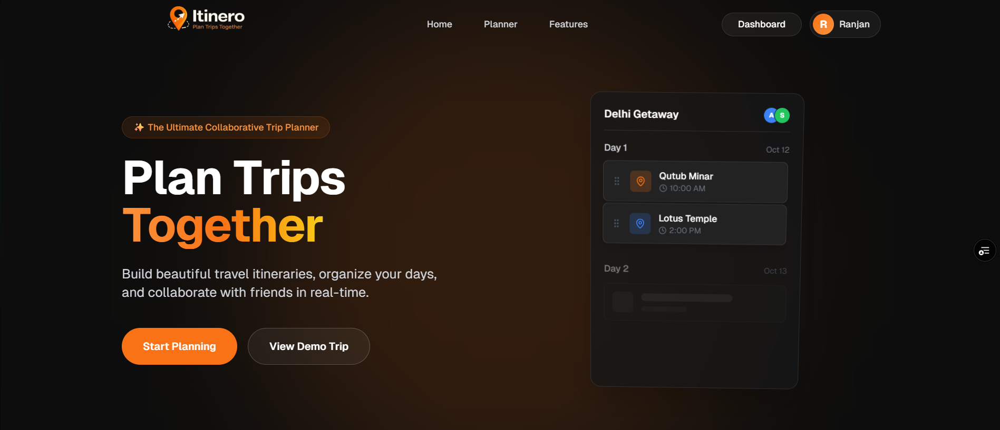
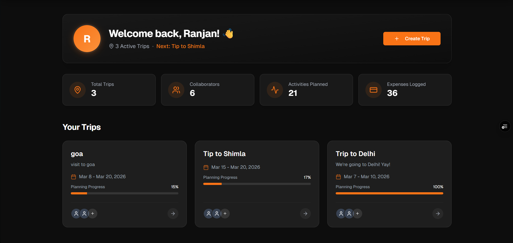
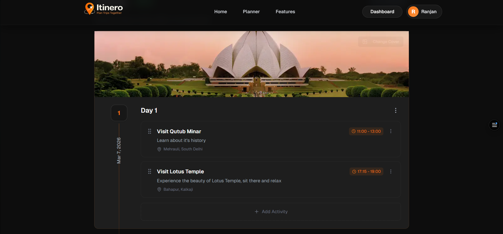
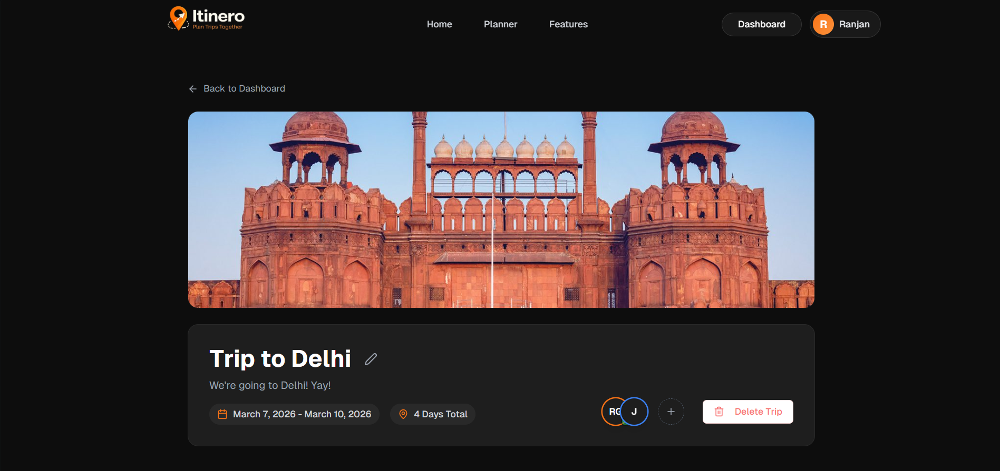
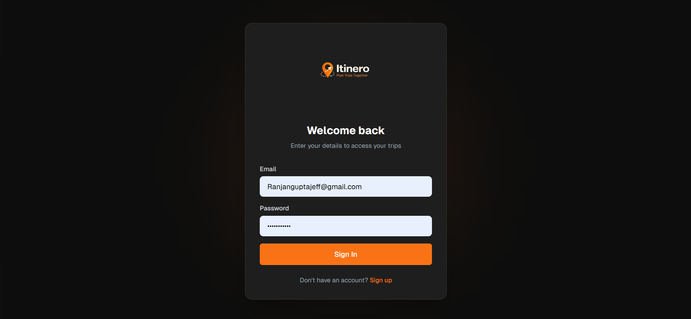
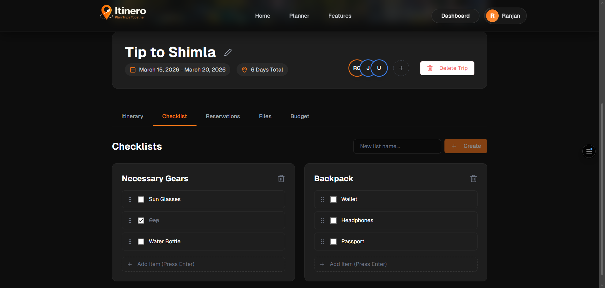
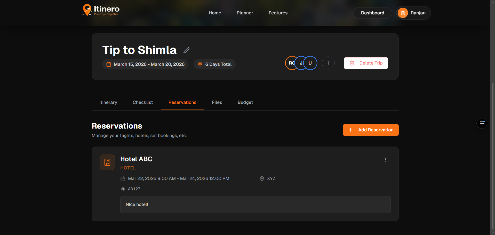
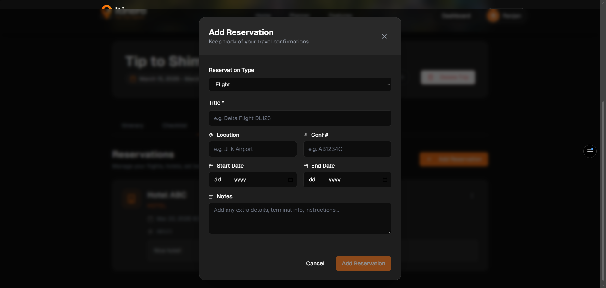
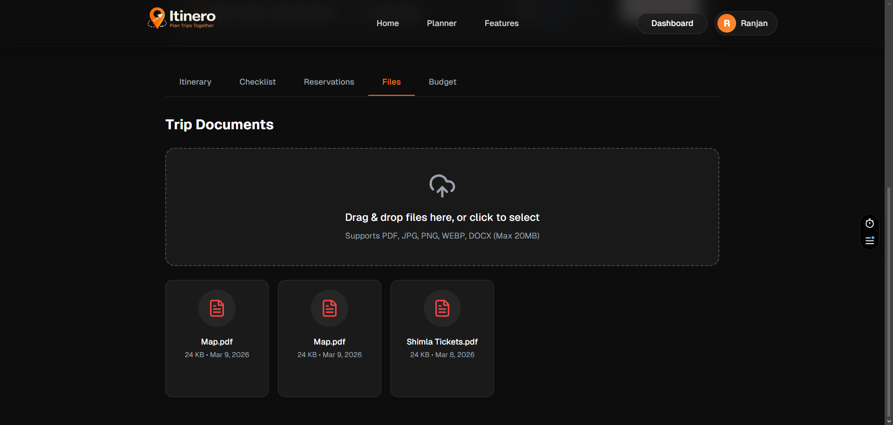
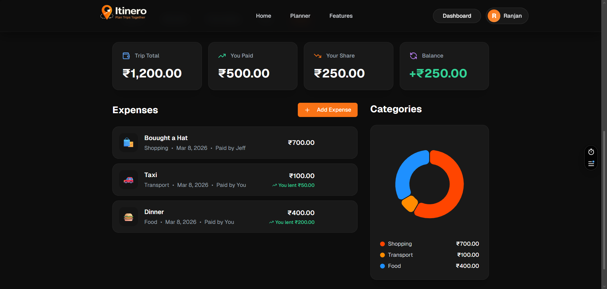

# Itinero — Collaborative Trip Planning SaaS

**Itinero** is a collaborative trip planning platform built during the **Cohort 26 Buildathon by [ChaiCode](https://chaicode.com)**.

The goal of this project was to create a modern SaaS-style application that allows users to **plan trips together, organize itineraries, and collaborate with friends in real-time**.

Instead of using scattered spreadsheets, chats, or notes, Itinero provides a centralized workspace where users can organize trips, plan activities day-by-day, and coordinate travel with their group.

---

# 🌐 Live Project

**Production URL**

👉 https://itinero.ranjangupta.online

---

# 🎥 Demo

You can watch a walkthrough demo here:

👉 Demo Video Link (Add your video link here)

Example options:

- Loom
- YouTube
- Screen recording

---

# 📸 Screenshots

## Home Page

---

## Dashboard

---

## Trip Itinerary Planner

---

## Collaborative Trip View

---

## Authentication Flow

---

## Checklist

---

## Reservations

---

## Trip Documents

---

## Budget & Expenses

---

# 📚 Documentation

## Overview

Itinero is a web-based application that enables users to:

- Create and manage trips
- Build day-wise itineraries
- Collaborate with other users
- Invite collaborators using join links
- Track trip progress and activities
- Organize travel plans visually

The application follows a **modern SaaS architecture** where the frontend handles UI and user interaction while backend services manage authentication, database, and session handling.

---

## Core Features

### Trip Management

Users can create trips with details like destination, description, and travel dates.

Each trip acts as a **workspace where collaborative planning happens**.

---

### Collaborative Planning

Users can invite collaborators using an **invite link**.

Once invited, collaborators can:

- View the trip
- Add activities
- Participate in planning
- Update itinerary items

This enables seamless **group trip planning**.

---

### Day-Wise Itinerary Builder

Trips are structured into **days**, allowing users to add activities for each day.

Activities can represent:

- Places to visit
- Experiences
- Travel checkpoints
- Reservations

This makes trip planning structured and easy to visualize.

---

### Authentication System

Secure authentication is implemented using:

- Email/password signup
- Email verification
- Session-based login

Only verified users can access the application.

---

### Secure Invite System

Trips can be shared using invite links.

Users joining through a link automatically become **collaborators of the trip**, enabling easy onboarding for group planning.

---

### Dashboard

Users get a dashboard showing:

- Active trips
- Collaborators
- Activities planned
- Trip progress

This acts as the **central hub for managing trips**.

---

# 🧠 Project Approach

The development approach focused on building a **production-ready SaaS application within a hackathon timeframe**.

Instead of building everything from scratch, the project leverages modern developer tools and backend services to accelerate development.

---

## Step 1 — Problem Selection

Trip planning with friends is messy.

People usually plan trips across:

- WhatsApp
- Google Docs
- Notes
- Spreadsheets

The goal was to build a **single platform where groups can plan trips together**.

---

## Step 2 — SaaS Architecture

The application was built using a **frontend + backend-as-a-service architecture**.

Frontend responsibilities:

- UI
- routing
- user interaction
- state management

Backend responsibilities:

- authentication
- database
- user management
- session handling

---

## Step 3 — UI/UX Design

The UI focuses on a **modern SaaS dashboard experience**.

Key design principles:

- minimal layout
- visual hierarchy
- trip progress indicators
- collaborative planning interface

---

## Step 4 — Authentication Flow

The authentication system includes:

1. User signup
2. Email verification
3. Session creation
4. Protected routes

This ensures only verified users can access trip data.

---

## Step 5 — Collaboration Model

Trips are shared workspaces.

Each trip contains:

- owner
- collaborators
- shared itinerary

Users can join trips using invite links, enabling frictionless collaboration.

---

## Step 6 — Deployment

The project is deployed on cloud infrastructure to ensure scalability and global access.

Frontend is hosted on a global edge platform while backend services run on a managed backend service.

---

# 📖 Project Learnings

Building Itinero provided several key technical and product learnings.

---

## Building a SaaS Product

This project involved thinking beyond code.

Important aspects included:

- onboarding flows
- authentication design
- collaboration features
- production deployment
- scalable architecture

---

## Backend-as-a-Service Architecture

Using a backend platform significantly accelerated development.

Key areas learned:

- authentication systems
- email verification
- API integration
- session management

---

## Production Deployment Challenges

Deployment exposed real-world engineering problems like:

- case-sensitive file systems
- build environment differences
- module resolution errors
- deployment caching issues
- domain configuration

Solving these issues was an important learning experience.

---

## Real-world Debugging

Production bugs are very different from local development issues.

Examples encountered:

- Vercel build errors
- Git casing conflicts
- environment variable issues
- authentication redirect loops

---

## Designing Collaborative Systems

Multi-user systems require careful design.

Important considerations include:

- shared resources
- invite flows
- user permissions
- data ownership

---

# ⚙️ Tech Stack

## Frontend

- **Next.js (App Router)**
- **React**
- **TypeScript**
- **TailwindCSS**
- **ShadCN UI**

These tools provide modern UI development with strong performance and developer experience.

---

## Backend / Infrastructure

- **Appwrite Cloud**

Used for:

- authentication
- database
- user management
- session handling

---

## Deployment

- **Vercel**

Used for:

- hosting the Next.js application
- automatic CI/CD deployments
- global edge delivery

---

## Domain & DNS

- **Vercel DNS**

Custom domain configured for production deployment.

---

# 🚀 Final Thoughts

Itinero was built during the **Cohort 26 Buildathon by ChaiCode** with the goal of building a real SaaS-style product from idea to deployment.

The project demonstrates how modern tools can be combined to build scalable applications quickly while maintaining strong UX and architecture.

More importantly, it reflects the journey of turning a simple idea into a working product through iteration, debugging, and deployment.

---

**Developer:** Ranjan Gupta  
**Hackathon:** Cohort 26 Buildathon — ChaiCode  
**Project:** Itinero
